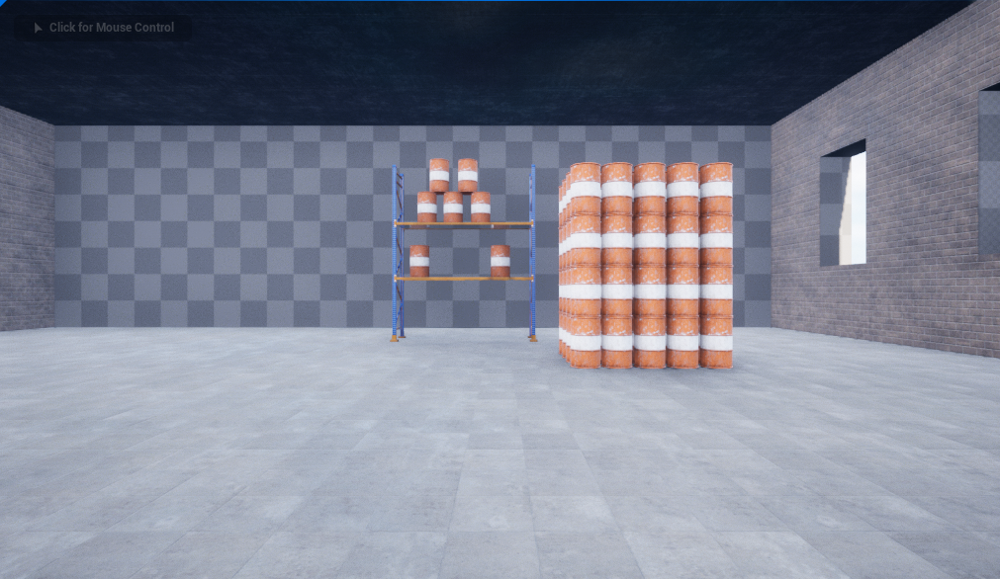
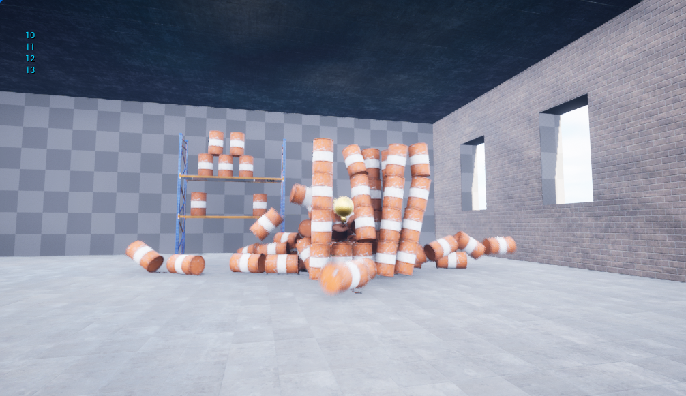
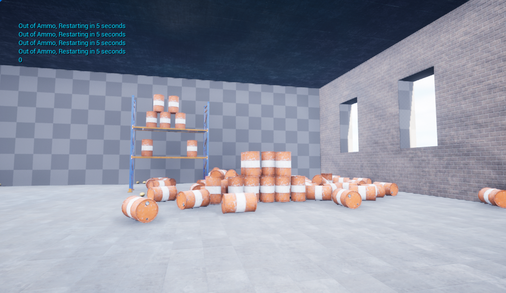

# Shoot and Wreck Game (230828)
### Udemy Course Example
Unreal Engine 5 C++ Developer: Learn C++ & Make video Games 강의 예제 1
- 최대 20개의 총알을 발사해 구조물을 무너뜨리는 게임
## TIL
- 블루프린트 이벤트 그래프 
  -  블루프린트 설계
     - Collapse to function
     - 순수 함수 (pure) / 실행 함수 
   - 다양한 노드 실습 
     - Add Impulse
     - 레벨 로드 / 지연 노드
     - GET / SET data 노드 
- Physics Simulation 탭 실습 
- Static Mesh - Collision
  - Mesh의 shape에 따라 collision 방향을 다르게 설정할 수 있음 
  - [관련 내용 - 공식 문서 링크](https://docs.unrealengine.com/5.0/ko/static-mesh-editor-ui-in-unreal-engine/)
  - ex) Z축 방향 원통형의 물체 
    - Add 10DOP-Z Simplified Collision
    - 10면체의 Z축에 최적화된 Collision 구조 생성
    - (윗면이 평평하지 못함 -> 윗면을 평평하게)
- 자료형 (Data types)
- 벡터 관련
  - 벡터의 덧셈과 곱셈
  - 전방 벡터 (카메라 기준) 가져오기 
- Asset Upload
- 지오메트리 브러시 (BSP)
  - subtract로 실내 공간 만들기  
- Material / Lights 기초 

## Results
### Environment

구조물을 쌓아 간단한 환경 구축
 
  

Space - 카메라(마우스) 회전 방향으로 쇠구슬 발사 
화면에 남은 총알 개수 표시 
  

  

총알(20개) 소진 시, 메세지와 함께 5초 후 새 게임 시작 
  